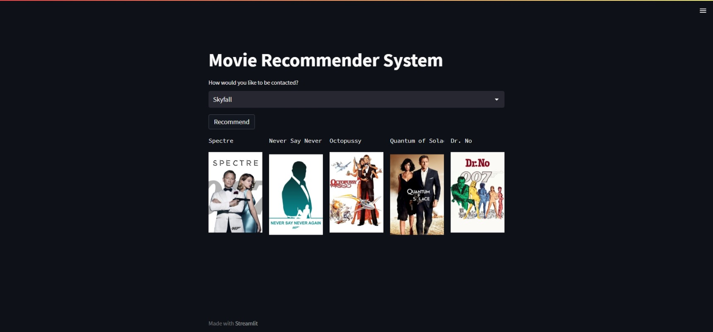

# Movie Recommender System

This project is a content-based Movie Recommender System built with Python and Streamlit. It suggests movies similar to the one selected by the user, using text-based features like genres, keywords, cast, and crew. The app fetches movie posters using the TMDB API.

## Features

- Suggests top 5 movies similar to the selected movie.
- Displays movie posters along with the recommendations.
- Uses natural language processing techniques for better similarity measures.

## Technologies Used

- **Python**: Data processing and machine learning.
- **Pandas**: Data manipulation.
- **Numpy**: Numerical operations.
- **NLTK**: Text preprocessing (stemming).
- **Scikit-learn**: Vectorization and similarity computation.
- **Streamlit**: Web application framework.
- **FAISS**: For efficient similarity search (optional, if used).
- **TMDB API**: Fetching movie posters.

## Setup Instructions

### 1. Clone the Repository

```bash
https://github.com/your-username/movie-recommender.git
cd movie-recommender
```

### 2. Create and Activate a Virtual Environment

```bash
python -m venv venv
# On Windows
venv\Scripts\activate
# On macOS/Linux
source venv/bin/activate
```

### 3. Install Required Packages

```bash
pip install -r requirements.txt
```

### 4. Download Datasets

Make sure to place the following datasets in your project directory:

- `tmdb_5000_movies.csv`
- `tmdb_5000_credits.csv`

### 5. Set Up TMDB API Key

1. Sign up at [TMDB](https://www.themoviedb.org/documentation/api) and get your API key.
2. Create a `.env` file in your project directory and add your API key:
   ```env
   TMDB_API_KEY=YOUR_API_KEY_HERE
   ```

### 6. Run the Application

```bash
streamlit run app.py
```

The application will launch in your default web browser.

## Usage

1. Select a movie from the dropdown menu.
2. Click on the **Recommend** button.
3. The app will display five recommended movies along with their posters.

## Screenshots



## Contact

For any inquiries, feel free to reach out at:

- **Email**: [sairupesh36@gmail.com](mailto\:sairupesh36@gmail.com)
- **LinkedIn**: [https://www.linkedin.com/in/sai-rupesh-85132a202/](https://www.linkedin.com/in/sai-rupesh-85132a202/)

---

Enjoy using the Movie Recommender System!

